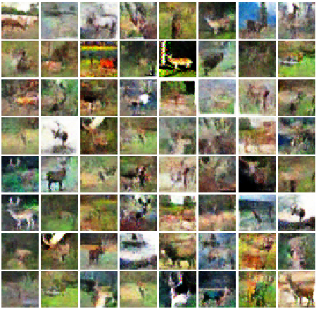
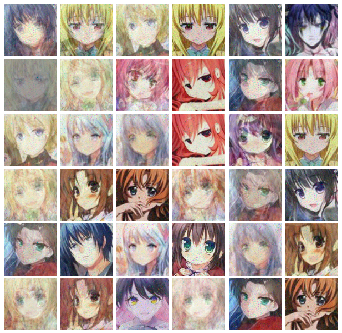
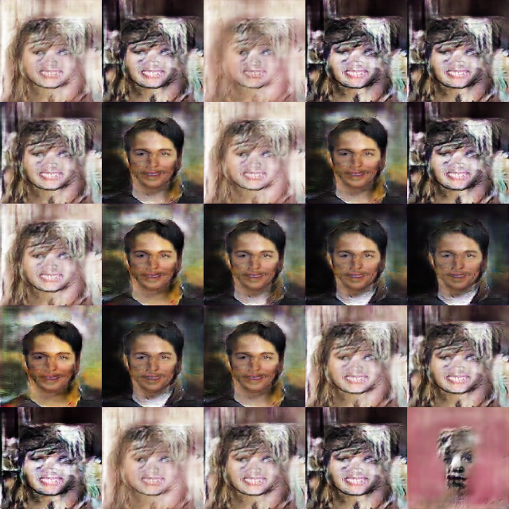

## NYU DS-3001 Machine Learning Project.
#Topic# Image_synthesis with DCGAN,  WGAN-GP, SAGAN

Collaborator: Lifan Wang,  Guanhua Chen,  Kuan Chen , Yueping Wang

## Instruction
This project aimed to use cifar10, celeba, customized dataset to generate new images
 
Load the *.ipython file within each folder and reproduce the result. 

## Datasets

We built our DCGAN/WGAN model from CIFAR-10, Comic faces dataset. 

We built our SAGAN model from  Comic faces dataset, celeba.

## Results
The network would generate fake images during the training process, they are stored in the folders.  

Cifar10:　　　　　　　　　　　　　　Comic faces:　　　  　　　　　　　Celeba:

## References
WGAN-GP https://zhuanlan.zhihu.com/p/25071913  
Comic faces https://cloud.tencent.com/developer/article/1055514  
[1]IanJ.Goodfellow,JeanPouget-Abadie,MehdiMirza, Bing Xu, David Warde-Farley, Sherjil Ozair, Aaron Courville, Yoshua Bengio. Generative Adversarial Networks. arXiv:1406.2661   
[2]MartinArjovskyandSoumithChintalaandLonBottou. Wasserstein GAN. arXiv:1701.07875, 2017.   
[3]Alec Radford, Luke Metz, Soumith Chintala. UnsupervisedRepresentationLearningwithDeepConvolutional Generative Adversarial Networks. arXiv:1511.06434   
[4] Xin Guo, Johnny Hong, Tianyi Lin, Nan Yang. Relaxed WassersteinwithApplicationstoGANs. arXiv:1705.07164  

